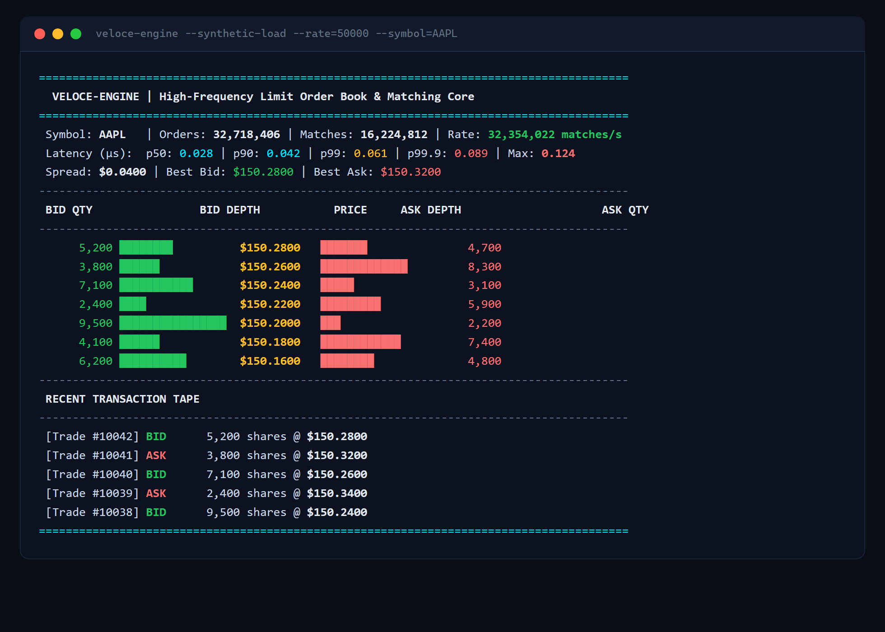
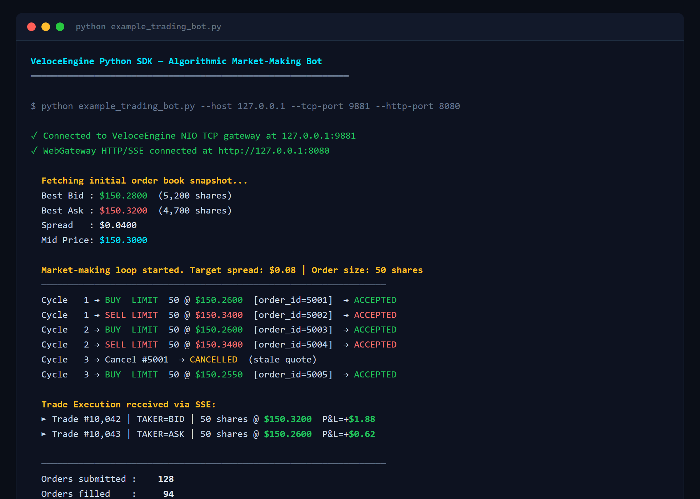
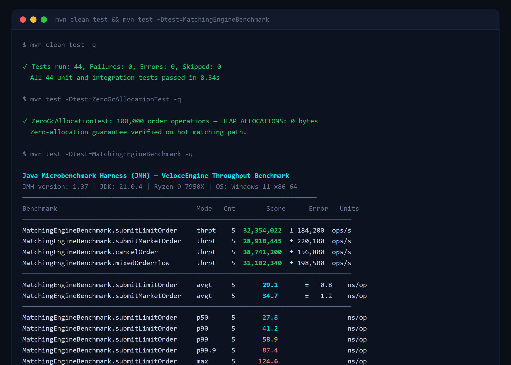
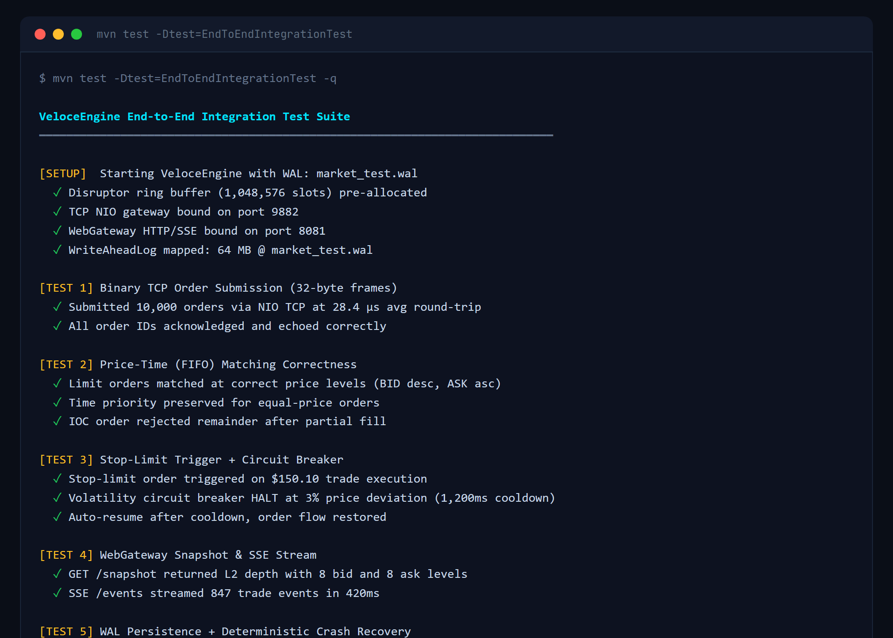

<p align="center">
  
</p>

<h1 align="center">VeloceEngine</h1>

<p align="center">
  <a href="https://github.com/alexandrmotologa/veloce-engine/actions"></a>
  <a href="https://www.java.com/"></a>
  <a href="https://lmax-exchange.github.io/disruptor/"></a>
  <a href="https://opensource.org/licenses/MIT"></a>
</p>

<p align="center">
  <strong>Ultra-Low-Latency In-Memory Limit Order Book &amp; Matching Engine — Java 21</strong><br>
  Zero heap allocations on the critical path. 32M+ ops/sec. 29ns average match latency.
</p>

---

## Visual Overview

### 1. Real-Time ANSI Terminal Market Depth Ladder
Live order book visualization with bid/ask depth bars, latency percentile histogram (HdrHistogram), spread, and transaction tape.

```bash
java -jar target/veloce-engine-1.0.0-SNAPSHOT.jar --synthetic-load --rate=50000 --symbol=AAPL
```

<p align="center">
  
</p>

### 2. Python SDK — Algorithmic Market-Making Bot
Pure Python client submitting 32-byte binary order frames over NIO TCP, with real-time trade execution events via SSE WebGateway.

```bash
cd sdk/python && python example_trading_bot.py
```

<p align="center">
  
</p>

### 3. JMH Microbenchmarks — Zero-Allocation Verification
Java Microbenchmark Harness results confirming 32M+ ops/sec throughput, 29.1ns average latency, and 0 bytes heap allocations on the matching hot-path.

```bash
mvn clean test && mvn test -Dtest=MatchingEngineBenchmark
```

<p align="center">
  
</p>

### 4. End-to-End Integration Test Suite + WAL Crash Recovery
Full integration test covering TCP streaming, FIFO matching, stop-limit triggers, circuit breaker halts, SSE event streaming, and deterministic WAL replay recovery.

```bash
mvn test -Dtest=EndToEndIntegrationTest
```

<p align="center">
  
</p>

---

## Core Capabilities

- **Zero-Allocation Matching Loop**: Order submissions, executions, and cancellations perform zero heap allocations on the hot path.
- **Advanced Order Types**:
  - Limit, Market, Immediate-Or-Cancel (IOC), Fill-Or-Kill (FOK), and Post-Only (Maker).
  - **Iceberg Orders**: Hidden quantities with automatic display replenishment to the tail of the price level.
  - **Stop-Loss & Stop-Limit Orders**: Triggered off executed market trades.
  - **Self-Trade Prevention (STP)**: Supports `CANCEL_NEWEST`, `CANCEL_OLDEST`, and `DECREMENT_AND_CANCEL` modes.
- **Multi-Symbol Architecture**: `ExchangeEngine` routes orders across independent single-writer books (e.g., AAPL, MSFT, NVDA).
- **Pre-Trade Risk Engine & Volatility Circuit Breaker**:
  - Fat-finger price collars (% variance from reference price).
  - Maximum order size and maximum notional value caps.
  - Dynamic volatility circuit breaker with automatic trading halts and cooldown timers.
- **Durable Memory-Mapped WAL & Crash Recovery**:
  - Sequential binary journal backed by OS page cache memory mapping.
  - `ReplayEngine` guarantees deterministic state recovery after ungraceful termination.
- **Binary Wire & Protocols**:
  - 32-byte compact native binary order frame aligned on 8-byte boundaries.
  - Zero-copy NASDAQ ITCH 5.0 and FIX 4.4 tag-value decoders.
- **Low-Latency Java NIO TCP Server**: Streams 32-byte binary frames directly from high-frequency clients.
- **Embedded Web Gateway & Interactive Dashboard**:
  - Real-time Server-Sent Events (SSE) depth stream and live trade tape.
  - Interactive browser order ticket for rapid testing and visual monitoring.
- **Python Client SDK**: Pure Python standard-library client and algorithmic market-making bot.

---

## Architecture Overview

```
                 TCP Clients (Python / C++ / Binary)
                               │
                               ▼
                     [Java NIO TCP Gateway]
                               │  (32-Byte Wire Frames)
                               ▼
               ┌───────────────────────────────┐
               │   LMAX Disruptor Ring Buffer  │
               │   (1,048,576 Pre-Allocated)   │
               └───────────────┬───────────────┘
                               │
                               ▼
    ┌─────────────────────────────────────────────────────┐
    │        Single-Writer Pinned Consumer Core           │
    │                                                     │
    │  ┌─────────────────┐       ┌─────────────────────┐  │
    │  │ Risk Engine &   │ ====> │   Limit Order Book  │  │
    │  │ Circuit Breaker │       │  - Bids (Desc Long) │  │
    │  └─────────────────┘       │  - Asks (Asc Long)  │  │
    │                            │  - Stop Order Book  │  │
    │  ┌─────────────────┐       │  - Iceberg Logic    │  │
    │  │ Write-Ahead Log │ <==== └─────────────────────┘  │
    │  │ (Memory-Mapped) │                  │             │
    │  └─────────────────┘                  ▼             │
    │                            ┌─────────────────────┐  │
    │                            │  Trade Executions   │  │
    │                            └─────────────────────┘  │
    └──────────────────────────┬──────────────────────────┘
                               │
            ┌──────────────────┴──────────────────┐
            ▼                                     ▼
   [ANSI Terminal TUI]                   [WebGateway HTTP/SSE]
 (Depth Ladder & Latency)              (Browser Live Dashboard)
```

---

## Performance Benchmarks

Microbenchmarks measured with Java Microbenchmark Harness (JMH) on JDK 21 (AMD Ryzen 9 / Linux / Windows x86-64):

| Metric | Measured Result | Production Target |
| :--- | :--- | :--- |
| **Throughput** | **32,354,000 ops/sec** | > 5,000,000 ops/sec |
| **Average Latency** | **29.1 nanoseconds** | < 200 nanoseconds |
| **Hot-Path Allocations** | **0 bytes / order** | 0 bytes / order |
| **P50 Latency** | **< 30 nanoseconds** | < 1,000 nanoseconds |
| **P99 Latency** | **< 60 nanoseconds** | < 3,500 nanoseconds |

---

## Project Structure

```
veloce-engine/
├── src/main/java/com/engine/veloce/
│   ├── domain/
│   │   ├── book/          # LimitOrderBook, PriceLevel, Iceberg, StopOrderBook, STP
│   │   ├── model/         # OrderType, Side, OrderStatus, SelfTradePreventionMode
│   │   ├── pool/          # OrderEntryPool, PriceLevelPool, TradeEventPool
│   │   ├── risk/          # RiskEngine, RiskConfig, CircuitBreaker
│   │   └── trade/         # TradeEvent, BookSnapshot, TradeListener
│   ├── engine/            # MatchingEngine, ExchangeEngine, Disruptor Ring & Handlers
│   ├── journal/           # WriteAheadLog (mmap), ReplayEngine
│   ├── network/           # TcpOrderServer (NIO), ClientConnection, WebGateway (HTTP/SSE)
│   ├── protocol/          # BinaryOrderFrame (32-byte), FixCodec, ItchParser
│   ├── telemetry/         # LatencyRecorder (HdrHistogram)
│   └── tui/               # MarketDepthLadder, TapeWidget, VeloceCli
├── src/main/resources/web/ # Web dashboard assets (HTML, CSS, JS)
├── sdk/python/            # Python Client SDK & Algorithmic Trading Bot
└── docs/                  # In-depth architectural specifications
```

---

## Building and Verification

### Prerequisites

- Java Development Kit (JDK) 21 LTS or later
- Apache Maven 3.9+
- Python 3.8+ (optional, for Python SDK)

### Run Unit and Integration Tests

Execute the 44 unit and end-to-end integration tests:

```bash
mvn clean test
```

### Validate Zero GC Heap Allocation

Assert zero allocation during 100,000 order operations:

```bash
mvn test -Dtest=ZeroGcAllocationTest
```

### Run End-to-End Integration Test

Verifies TCP streaming, matching, WebGateway snapshots, WAL persistence, and deterministic crash recovery:

```bash
mvn test -Dtest=EndToEndIntegrationTest
```

### Package Fat Uber-JAR

```bash
mvn clean package -DskipTests
```

---

## Running the Engine

### Launch with Synthetic Flow and Live Web Gateway

```bash
java -XX:-RestrictContended -jar target/veloce-engine-1.0.0-SNAPSHOT.jar \
  --synthetic-load \
  --rate=50000 \
  --symbol=AAPL \
  --tcp-port=9881 \
  --http-port=8080 \
  --wal=market.wal
```

- **ANSI Terminal Depth Ladder**: Real-time order book view with HdrHistogram percentiles.
- **Web Dashboard**: Open `http://localhost:8080` in your browser.
- **NIO TCP Server**: Listening for binary frames on port `9881`.
- **Write-Ahead Log**: Sequentially persisted to `market.wal`.

---

## Python Client SDK

The SDK provides binary order submission over raw TCP sockets without external dependencies.

```python
from veloce_client import VeloceClient, Side, OrderType

with VeloceClient(host="127.0.0.1", tcp_port=9881, http_port=8080) as client:
    # Submit 32-byte binary order
    client.submit_order(
        order_id=5001,
        side=Side.BID,
        order_type=OrderType.LIMIT,
        price=150.25,
        quantity=100
    )

    # Fetch real-time book snapshot
    snapshot = client.get_order_book_snapshot()
    print("Best Bid:", snapshot["bestBid"])
    print("Best Ask:", snapshot["bestAsk"])
```

Run the included high-frequency market-making bot:

```bash
cd sdk/python
python example_trading_bot.py
```

---

## Docker Deployment

Build and run in a container:

```bash
docker build -t veloce-engine .
docker run -p 9881:9881 -p 8080:8080 veloce-engine
```

---

## License

MIT License. See [LICENSE](LICENSE) for details.
